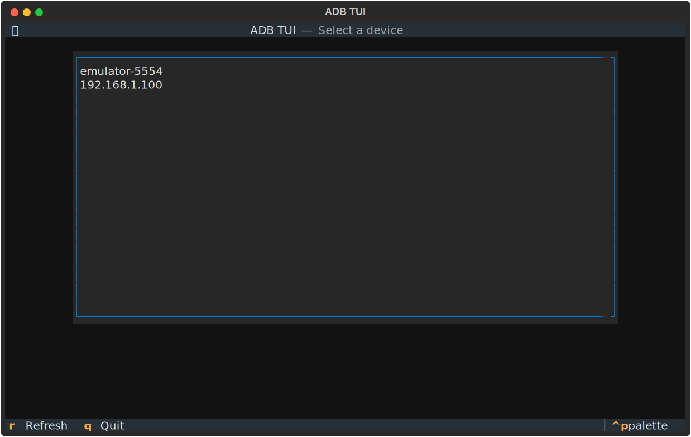
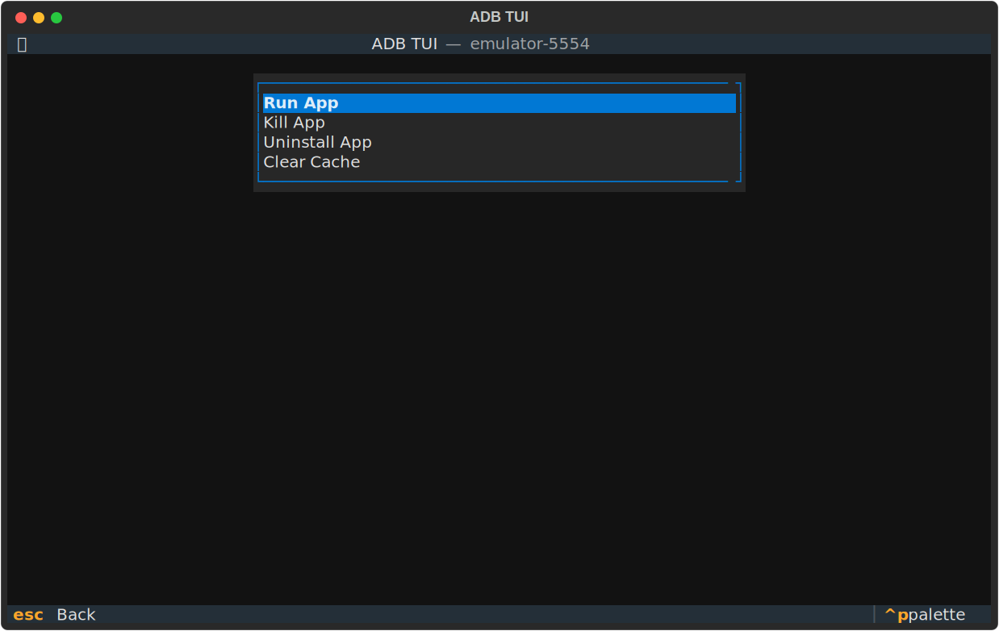
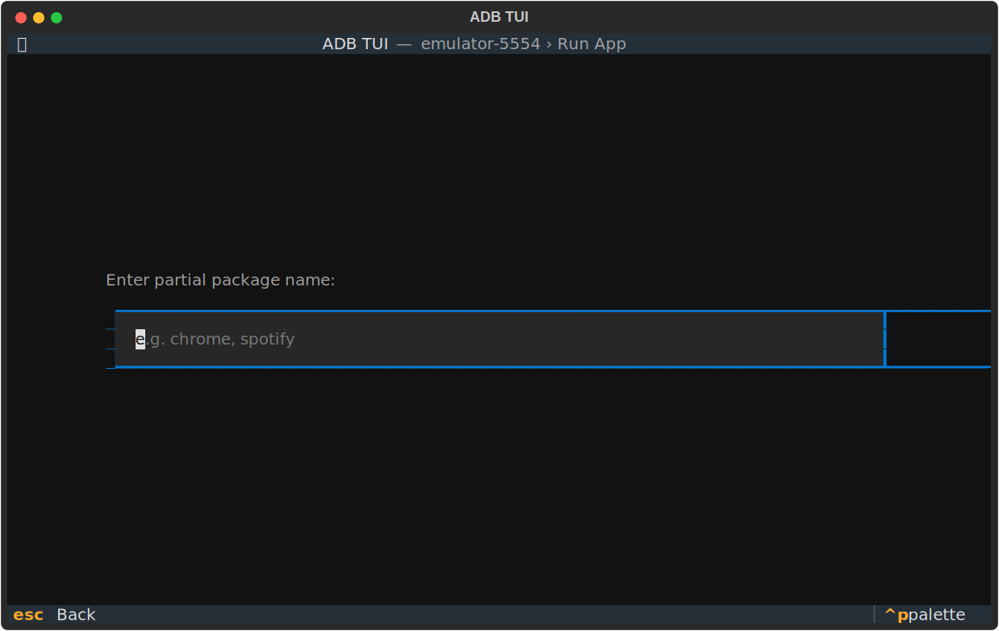
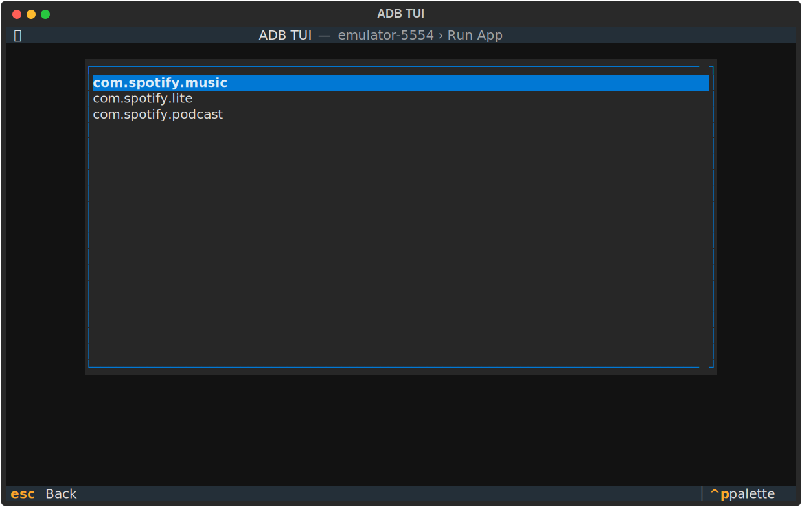

# ADB TUI

A terminal UI for managing Android apps via ADB, built with [Textual](https://textual.textualize.io/).

Select a connected device, pick an action (run, kill, uninstall, clear cache), search for a package by partial name — done.

## Requirements

- Python 3.9+
- [`adb`](https://developer.android.com/tools/adb) in your PATH
- At least one connected Android device or emulator

## Install

```sh
uv tool install git+https://github.com/majorbriggs/adb-tui
# or
pip install git+https://github.com/majorbriggs/adb-tui
```

## Usage

```sh
adb-tui
```

## Screenshots

<p align="center">
  
  
</p>
<p align="center">
  
  
</p>

## Navigation

| Key | Action |
|-----|--------|
| `↑` / `↓` | Move selection |
| `Enter` | Confirm |
| `Esc` | Go back |
| `R` | Refresh device list |
| `Q` | Quit |
